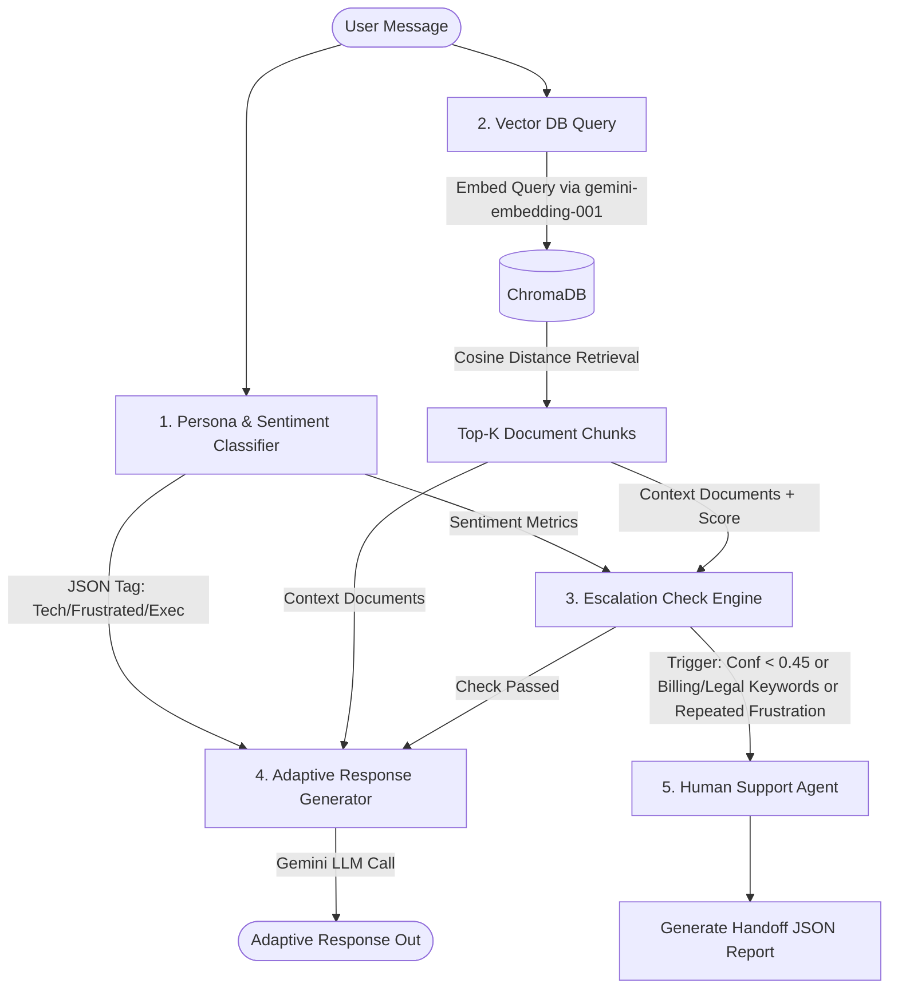

# Persona-Adaptive Customer Support Agent with RAG and Human Escalation

An intelligent, cognitive customer support agent that classifies user communication personas (Technical Expert, Frustrated User, Business Executive) in real-time, retrieves factual documentation from a local vector store (ChromaDB), adapts its response style, and executes a structured human-in-the-loop escalation workflow when necessary.

---

## 🛠️ Tech Stack & Versioning

*   **Operating System:** Windows, macOS, Linux
*   **Programming Language:** Python 3.11+
*   **LLM & Embedding API Client:** `google-genai` (Official Google GenAI SDK `>=0.1.0`)
*   **Language Models:**
    *   Generative Text: `gemini-2.5-flash` (Fast, low-latency cognitive reasoning)
    *   Embeddings: `gemini-embedding-001` (768 dimensions)
*   **Vector Database:** `chromadb>=0.4.0` (Local embedded vector engine configured with Cosine Similarity space)
*   **Document Processing:**
    *   Chunking Algorithm: `RecursiveCharacterTextSplitter` from `langchain-text-splitters>=0.0.1`
    *   PDF Parsing: `pypdf>=3.0.0`
*   **UI Framework:** `streamlit>=1.30.0` (Premium custom glassmorphic styling, real-time widgets, and diagnostics)
*   **Document Generation:** `reportlab>=4.0.0` (Programmatic PDF building)
*   **Environment Configuration:** `python-dotenv>=1.0.0`

---

## 📐 System Architecture Diagram

Below is the functional dataflow layout of the agentic workflow:



---

## 🧠 Core System Design & Implementation

### 1. Persona Detection Strategy
Our persona classifier (`src/classifier.py`) evaluates tone, sentence complexity, syntax, and punctuation using a **Structured Output JSON schema** powered by `gemini-2.5-flash`.
*   **Technical Expert:** Identified by technical terms, syntax queries, requests for logs, and system error codes. System instructions direct the LLM to reply with detailed, step-by-step logs, code snippets, and structural parameters.
*   **Frustrated User:** Identified by emotionally charged vocabulary, exclamation marks, caps lock, and urgency. System instructions direct the LLM to begin with empathetic validation, use simple language, and outline clear action bullets without jargon.
*   **Business Executive:** Identified by outcome-centric, ROI, SLA, and timeline-focused language. System instructions direct the LLM to provide brief, high-level summaries highlighting resolution times and operational impact.
*   **Bonus Features:** The classifier extracts real-time customer **Sentiment** (Positive, Neutral, Frustrated, Angry) used for sentiment tracking.

### 2. RAG Pipeline Design
*   **Ingestion & Parsing:** Text (`.md`, `.txt`) is read directly. PDF files are processed page-by-page using `pypdf`, preserving the page numbers in chunk metadata.
*   **Chunking Strategy:** Documents are chunked into size `400` with `40` character overlaps using `RecursiveCharacterTextSplitter`. This preserves context boundaries (like configuration headers and API blocks).
*   **Embedding Model:** Chunks are mapped to vectors using `gemini-embedding-001` (768 dimensions) via `google-genai`.
*   **Vector Store & Metrics:** Embeddings are indexed in ChromaDB client. We explicitly configure Chroma to use **Cosine Similarity** (`"hnsw:space": "cosine"`). Since Chroma returns Cosine Distance, the similarity confidence score is calculated mathematically as:
    $$\text{Similarity}(Q, D) = 1.0 - \text{Distance}$$

### 3. Escalation Logic & Configurable Triggers
The Escalation Engine (`src/escalator.py`) handles rules that bypass automated responses:
1.  **Low Confidence:** Triggered if the highest retrieved document similarity score is below the threshold (default: `0.45`).
2.  **Sensitive Content:** Triggered if the query contains account-sensitive keywords (e.g., `refund`, `sue`, `legal`, `compromised`, `double charge`, `delete account`).
3.  **Persistent Frustration:** Triggered if consecutive turns of negative user sentiment (Frustrated/Angry) exceed the limit (default: `2`).
4.  **No Context:** Triggered if database is empty or no matches are found.

When triggered, the system halts AI answers and generates a structured **Human Handoff JSON**:
```json
{
  "persona": "Frustrated User",
  "sentiment": "Angry",
  "user_issue_summary": "My billing statement has unexpected duplicate charges. I demand an immediate refund!",
  "escalation_reason": "Sensitive content detected (matched keywords: refund, duplicate charge).",
  "confidence_score": 0.582,
  "documents_used": ["refund_policy.md", "billing_policy.txt"],
  "attempted_steps": ["Identified billing/refund request"],
  "recommended_action": "Locate subscription transaction ID in Stripe, evaluate refund eligibility, and process credit manually.",
  "conversation_history": [ ... ]
}
```

---

## ⚡ Setup & Installation Instructions

Follow these steps to run the project locally on Windows, macOS, or Linux.

### 1. Clone & Set Up Directory
Create a directory named `adaspark` or navigate to your project folder:
```bash
cd adaspark
```

### 2. Create Virtual Environment & Install Dependencies
Initialize a python virtual environment:
```bash
python -m venv venv
# On Windows:
venv\Scripts\activate
# On macOS/Linux:
source venv/bin/activate

pip install -r requirements.txt
```

### 3. Configure Credentials (`.env`)
Create a `.env` file in the root directory:
```env
GEMINI_API_KEY="YOUR_ACTUAL_GOOGLE_GEMINI_API_KEY"
GEMINI_MODEL="gemini-2.5-flash"
EMBEDDING_MODEL="gemini-embedding-001"
CHROMA_DB_DIR="./chroma_db"
RETRIEVAL_CONFIDENCE_THRESHOLD=0.45
MAX_CONSECUTIVE_FRUSTRATION=2
CHUNK_SIZE=400
CHUNK_OVERLAP=40
```

### 4. Build Knowledge Base Documents
Run the programmatic PDF builder helper script to compile the required binary PDF:
```bash
python generate_pdf.py
```
This generates `data/password_reset_guide.pdf` containing password lockout rules.

---

## 🏃 Running the Application

### Option A: Streamlit Web UI (Recommended)
Launch the premium web application dashboard:
```bash
streamlit run app.py
```
The interface provides:
*   A active chat panel.
*   Document Library tab to view knowledge base articles.
*   Diagnostics tab showing actual JSON classifications, retrieved scores, system instructions, and Handoff outputs.
*   A sidebar panel to override API Keys, thresholds, and rebuild databases.
*   Scenario quick-buttons to run test cases in 1-click.

### Option B: CLI Integration Test Script
To execute the end-to-end classification, RAG retrieval, and escalation pipeline in the terminal, run:
```bash
python scratch/test_pipeline.py
```

---

## 🧪 Verification & Example Scenarios

Test the system with these 5 pre-built scenario test inputs:

1.  **Frustrated User (Empathetic Response):**
    *   *Query:* `"Where is the guide to clear cookies? It's been an hour and nothing is loading on your interface!"`
    *   *Behavior:* Empathetic validation, simple bullet steps.
2.  **Technical Expert (Developer response):**
    *   *Query:* `"What are the header parameter requirements for your bearer token auth implementation?"`
    *   *Behavior:* Details raw HTTP header parameters and auth syntax block.
3.  **Business Executive (Brief business guide):**
    *   *Query:* `"Our operational uptime is decreasing. We need a timeline of when billing disputes are resolved."`
    *   *Behavior:* Brief, focused on resolution times and service levels.
4.  **Technical Expert (RAG Database retrieval):**
    *   *Query:* `"I'm experiencing an issue with your database integration that's causing internal errors."`
    *   *Behavior:* Searches database files, outlines configuration pathways.
5.  **Sensitive Issue (Human Handoff):**
    *   *Query:* `"My billing statement has unexpected duplicate charges. I demand an immediate refund!"`
    *   *Behavior:* Triggers billing sensitivity flag, creates handoff JSON block, halts AI.

---

## ⚠️ Known Limitations & Future Improvements

1.  **Embedding Rate Limits:** High concurrency requests can hit Gemini Embedding API quotas.
    *   *Improvement:* Implement caching layer or exponential backoff in the client code.
2.  **Stateless Chroma Client:** Streamlit is serverless-style and recreates database connections.
    *   *Improvement:* Utilize Streamlit's `@st.cache_resource` wrapper to preserve collection reference.
3.  **PDF Layout Complexity:** `pypdf` extracts raw text lines which can mangle tabular data.
    *   *Improvement:* Integrate structured PDF OCR libraries like `pdfplumber` or `pytesseract`.
